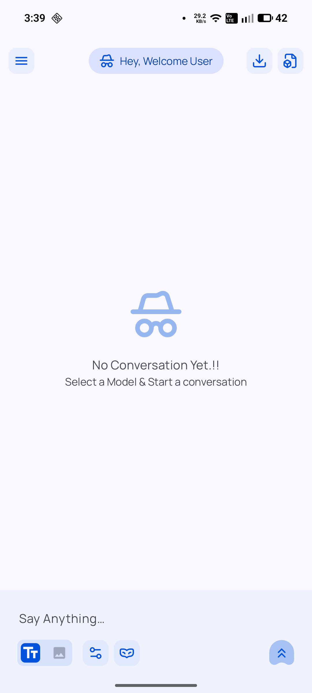
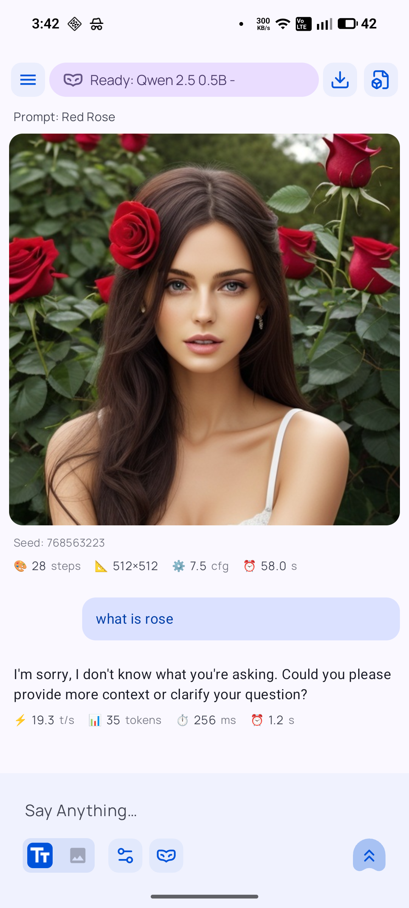
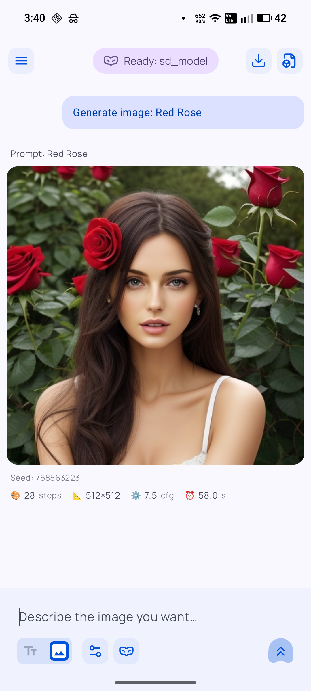
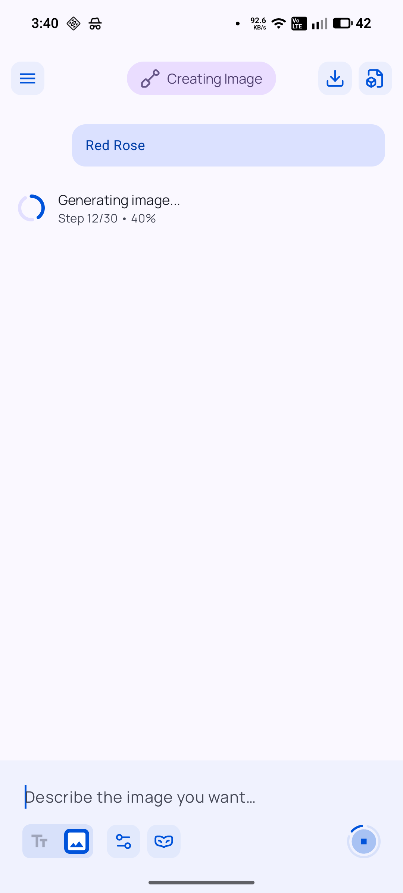
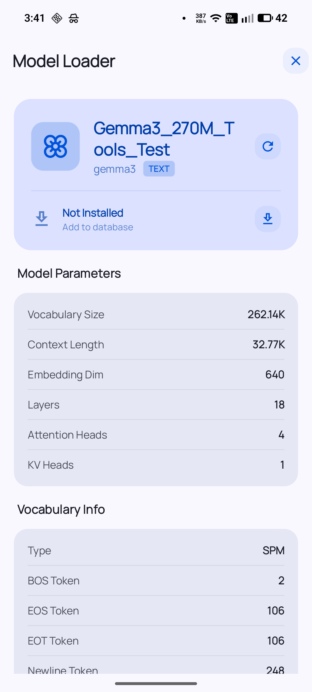
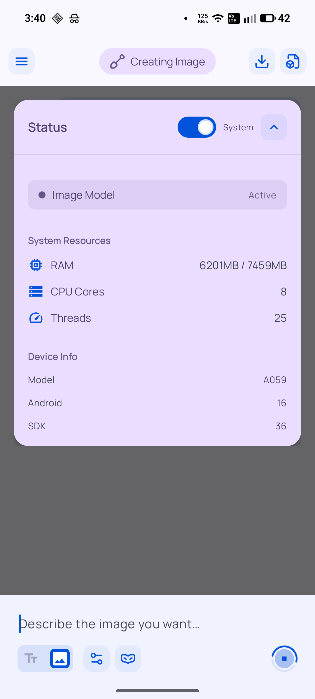

# ToolNeuron

### Privacy-First AI Assistant for Android

[](https://github.com/Siddhesh2377/ToolNeuron)
[](LICENSE)
[](https://github.com/Siddhesh2377/ToolNeuron/releases)
[](https://discord.gg/mVPwHDhrAP)

<p align="left">
  <a href="https://play.google.com/store/apps/details?id=com.dark.tool_neuron">
    
  </a>
</p>

ToolNeuron is an offline-first AI assistant for Android that runs large language models and image generation completely on-device. No cloud dependencies. No subscriptions. Your data never leaves your phone.

**What it does:**
- Run any GGUF text model locally (Llama, Mistral, Gemma, etc.)
- Generate images with Stable Diffusion 1.5 (censored & uncensored)
- Encrypted storage with crash recovery
- Zero telemetry or tracking
- Works completely offline

[Download APK](https://github.com/Siddhesh2377/ToolNeuron/releases) ·
[Join Discord](https://discord.gg/mVPwHDhrAP) ·
[Report Issue](https://github.com/Siddhesh2377/ToolNeuron/issues)

---

## Screenshots

<table>
  <tr>
    <td></td>
    <td></td>
    <td></td>
  </tr>
  <tr>
    <td></td>
    <td></td>
    <td></td>
  </tr>
</table>

---

## Features

### Text Generation
- Run any GGUF model locally (Llama 3, Mistral, Gemma, Phi, etc.)
- Users report 7-second response times for 8B Q6 models on flagship devices
- Custom model configurations (temperature, top-k, top-p, context length)
- Add HuggingFace repositories to browse available models
- Load local models without storage permissions

### Image Generation
- Stable Diffusion 1.5 (censored & uncensored variants)
- Powered by LocalDream
- 30-90 second generation times depending on device
- Full control over prompts and parameters

### Privacy & Security
- Hardware-backed AES-256-GCM encryption (Android KeyStore)
- Write-Ahead Logging (WAL) for crash recovery
- LZ4 compression for efficient storage
- Content deduplication via SHA-256
- Zero telemetry, analytics, or tracking
- All processing happens on-device

### Storage & Memory
- Encrypted conversation history
- Three-tier caching system (3-5MB during normal use)
- Memory-mapped model loading
- Automatic RAM optimization
- Export conversations and generated images

### Coming Soon
- RAG system for document injection (nearly complete)
- Optimized plugin/tool system
- Text-to-Speech (TTS) and Speech-to-Text (STT)
- Multi-modal support (vision models)

---

## Installation

### System Requirements

**Minimum (Text Only):**
- Android 8.0+ (API 26)
- 6GB RAM
- 4GB free storage

**Recommended (Text + Image):**
- Android 10+
- 8GB RAM (12GB preferred)
- 8GB free storage
- Snapdragon 8 Gen 1 or equivalent

### Download

**Google Play Store (Recommended):**
[Get it on Play Store](https://play.google.com/store/apps/details?id=com.dark.tool_neuron)

**Direct APK:**
Download from [GitHub Releases](https://github.com/Siddhesh2377/ToolNeuron/releases)

---

## Quick Start

### 1. Get Models

**Option A: Browse Model Store (In-App)**
- Open ToolNeuron
- Navigate to Model Store
- Add HuggingFace repository (e.g., `QuantFactory/Meta-Llama-3-8B-GGUF`)
- Browse and download models with one tap

**Option B: Manual Download**
- Visit [Hugging Face GGUF Models](https://huggingface.co/models?other=gguf)
- Download a model (Recommended: Llama-3-8B-Q4_K_M.gguf)
- Load in ToolNeuron without needing storage permissions

**Recommended Models:**
- **Budget:** TinyLlama-1.1B-Q4_K_M (669MB)
- **Balanced:** Llama-3-8B-Q4_K_M (4.5GB)
- **Quality:** Mistral-7B-Q6_K (6GB)
- **Medical:** Bio-Medical-Llama-3-8B (find on HF)

### 2. Generate Text

1. Select or import your GGUF model
2. Wait for model to load
3. Start chatting

### 3. Generate Images

1. Download SD 1.5 model from HuggingFace
2. Import into ToolNeuron
3. Enter prompt and generate

---

## Technical Details

### Architecture

**Core:**
- **Language:** Kotlin + C++ (JNI bindings)
- **UI:** Jetpack Compose
- **Text Inference:** llama.cpp
- **Image Inference:** Stable Diffusion 1.5 (LocalDream)
- **Storage:** Room + AES-256-GCM encryption
- **Async:** Kotlin Coroutines + Flow

### Storage System

The memory system uses:
- Write-Ahead Logging (WAL) for crash recovery
- LZ4 compression for storage efficiency
- SHA-256 content deduplication
- Hardware-backed encryption (Android KeyStore)
- Three-tier caching (L1: Hot cache, L2: Memory-mapped, L3: On-demand)

### Performance

**Text Generation (8B Q4_K_M):**
- 6GB RAM: 2-4 tokens/sec
- 8GB RAM: 4-8 tokens/sec
- 12GB RAM: 8-15 tokens/sec

**Image Generation (SD 1.5):**
- Mid-range (SD 8 Gen 1): 60-90 seconds
- Flagship (SD 8 Gen 3): 30-50 seconds

Performance varies by model size, quantization, and hardware.

---

## Use Cases

### Privacy-Critical Applications
- Medical professionals handling patient data
- Legal professionals with confidential documents
- Journalists protecting sources
- Anyone who values data sovereignty

### Offline Scenarios
- Air travel (no WiFi needed)
- Remote locations
- Areas with unreliable internet
- Avoiding mobile data costs

### Creative & Development
- Writing and brainstorming
- Code generation and debugging
- Image generation for content
- Learning and research

---

## Building from Source

```bash
# Clone repository
git clone https://github.com/Siddhesh2377/ToolNeuron.git
cd ToolNeuron

# Open in Android Studio (Ladybug or newer)
# Sync Gradle dependencies

# Build release APK
./gradlew assembleRelease

# Install on device
./gradlew installRelease
```

**Requirements:**
- Android Studio Ladybug+
- JDK 17
- Android SDK 34
- NDK 26.x

---

## Contributing

Contributions welcome. Focus areas:

- Bug fixes and stability
- Performance optimizations
- Device compatibility testing
- Documentation improvements
- UI/UX enhancements

**Process:**
1. Fork the repository
2. Create feature branch (`git checkout -b feature/name`)
3. Commit with clear messages
4. Test on real devices
5. Submit Pull Request

---

## Roadmap

### Version 1.1 (Current - January 2026)
- ✅ Text generation with any GGUF model
- ✅ Image generation with SD 1.5
- ✅ HuggingFace repository integration
- ✅ Encrypted memory system with WAL
- ✅ Model configuration editor
- 🚧 RAG system (nearly complete)
- 🚧 Plugin/tool system (in progress)

### Version 1.2 (Q1 2026)
- RAG document injection system
- Optimized plugin architecture
- Text-to-Speech (TTS) integration
- Speech-to-Text (STT) support

### Version 1.3 (Q2 2026)
- Multi-modal support (vision models)
- Additional model formats (ONNX, TFLite)
- Desktop companion app
- Advanced memory management

---

## Comparison

| Feature | ToolNeuron | Cloud AI Apps | Other Local AI |
|---------|------------|---------------|----------------|
| Text Generation | Any GGUF | Cloud only | Limited |
| Image Generation | SD 1.5 offline | Cloud only | Rare |
| Privacy | Complete offline | Server logging | Varies |
| Cost | Free | $20+/month | Varies |
| Internet | Not required | Required | Varies |
| Encryption | AES-256-GCM | N/A | Varies |
| Open Source | Apache 2.0 | Proprietary | Varies |
| Storage Permissions | Not needed | N/A | Usually needed |

---

## Privacy & Security

### Data Collection
**Zero data collection.** All processing happens on your device.

### What Stays Local
- All conversations
- Generated images
- Model configurations
- User preferences

### Encryption
- AES-256-GCM encryption for stored data
- Hardware-backed keys (Android KeyStore)
- Encrypted conversation database
- Secure memory management

### Verification
Fully open source. Audit the code or review community security assessments.

---

## Community Testimonials

> "The only LLM frontend capable of running 8B Q6 models on my hardware with lightspeed loading. I'm in military healthcare and privacy is critical. ToolNeuron is the only app that meets my requirements."  
> — Senior Healthcare Professional, Netherlands

---

## License

Apache License 2.0. See [LICENSE](LICENSE) for details.

**Commercial use permitted.** Use ToolNeuron in commercial products without restrictions.

---

## Acknowledgments

Built with:
- [llama.cpp](https://github.com/ggerganov/llama.cpp) - Efficient LLM inference
- [LocalDream](https://github.com/xororz/local-dream) - Stable Diffusion on Android
- [Jetpack Compose](https://developer.android.com/jetpack/compose) - Modern Android UI

---

## Support

- **Discord:** [Join Community](https://discord.gg/mVPwHDhrAP)
- **GitHub Issues:** [Report Bug](https://github.com/Siddhesh2377/ToolNeuron/issues)
- **Email:** siddheshsonar2377@gmail.com

---

## FAQ

**Q: Does this really work offline?**  
A: Yes. After downloading models, all AI processing happens on your device with zero internet dependency.

**Q: How much storage do I need?**  
A: 5-8GB for typical setup (one 7B GGUF + SD 1.5). Models range from 500MB to 10GB+.

**Q: Will this drain my battery?**  
A: Local AI is power-intensive. Keep device charged during extended use.

**Q: Is my data actually private?**  
A: Yes. Nothing leaves your device. Verify in the open-source code.

**Q: Can I use custom models?**  
A: Yes. Any GGUF text model or SD 1.5 checkpoint works.

**Q: Why don't you need storage permissions?**  
A: Android scoped storage allows direct model loading without broad storage access.

**Q: Why is image generation slow?**  
A: SD 1.5 is computationally expensive. 30-90 seconds is normal for mobile hardware.

---

<div align="center">

**Built by [Siddhesh Sonar](https://github.com/Siddhesh2377)**

Privacy-first AI for everyone

[⭐ Star this repository](https://github.com/Siddhesh2377/ToolNeuron) if you find it useful

</div>
